# Home Lab SIEM – Microsoft Sentinel

This project demonstrates the setup of a home lab SIEM (Security Information and Event Management) using Microsoft Sentinel on Azure. The goal is to simulate a real-world environment, generate security events, and analyze them using centralized logging and detection techniques.

---

## 📌 Overview

The lab simulates a vulnerable environment (honeypot) by exposing a Windows virtual machine to the internet. Security logs are collected and forwarded to a centralized Log Analytics Workspace, where they are analyzed using Microsoft Sentinel and KQL queries.

---

## 🏗️ Architecture

---

## ⚙️ Setup Steps

## Part 1. Azure Subscription

### 1️⃣ Create an Azure account and access the portal:

https://portal.azure.com

---

## Part 2. Infrastructure Deployment (Azure Resources)

### 1️⃣ Create a Resource Group: `RG-SOC-Lab` 
---
### 2️⃣ Create a Virtual Network: `Vnet-soc-lab` 
  - IP range: `10.0.0.0/24`
  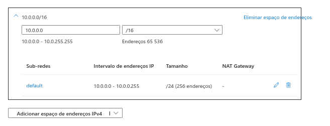
  
  - Overview of the Virtual Network configuration:
  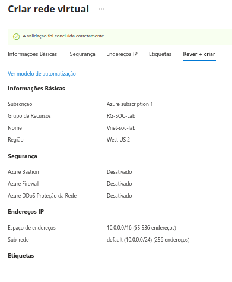

---
### 3️⃣ Deploy a Windows 10 Virtual Machine (Honeypot) 
  - Overview of the Virtual Machine configuration:
  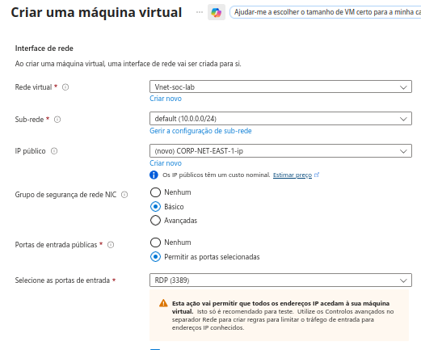

---
### 4️⃣ Network Security Group Configuration:
  - Create a rule that allows all traffic inbound

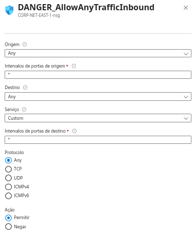

---
### 5️⃣ In Windows 10 VM, Disable Windows Firewall:
  - Turn off Domain Profile
  - Turn off Private Profile
  - Turn off Public Profile

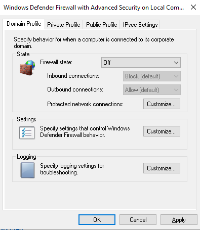

---
### Overview of all components (VM, Public IP, NSG, Network Interface):

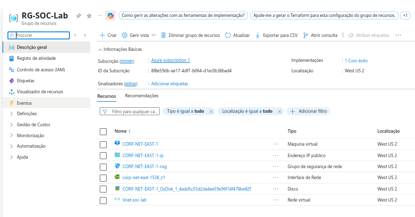

---
### Attempt to ping the VM's public IP address to verify network accessibility:

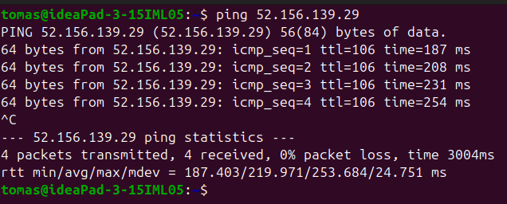

---

## Part 3. Generating Security Events

### 1️⃣ Perform failed login attempts

- Simulated unauthorized access attempts via RDP using a valid username and incorrect password to generate failed login events.

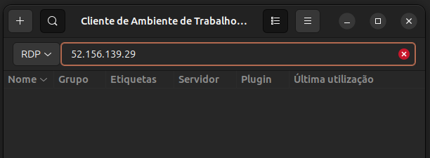
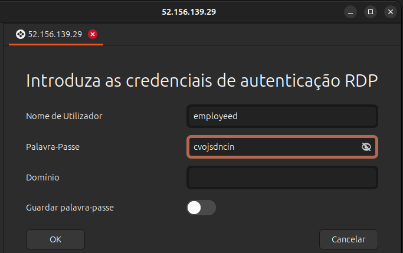

- Verified generated events on the virtual machine:
  - Event Viewer → Windows Logs → Security
  - Event ID: `4625` (Failed logon)

--- 

- Filtered view showing failed login attempts:

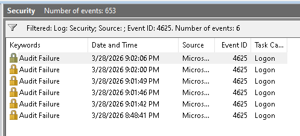

---

- Detailed view of a single failed login event:

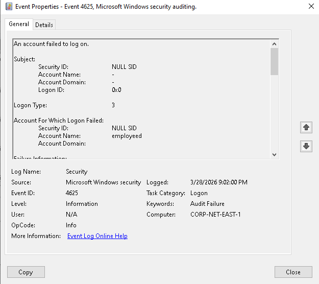

---

## Part 4. Log Collection & Sentinel Integration

### 1️⃣ Create a **Log Analytics Workspace (LAW)**

  - Overview of the Log Analytics Workspace configuration:
  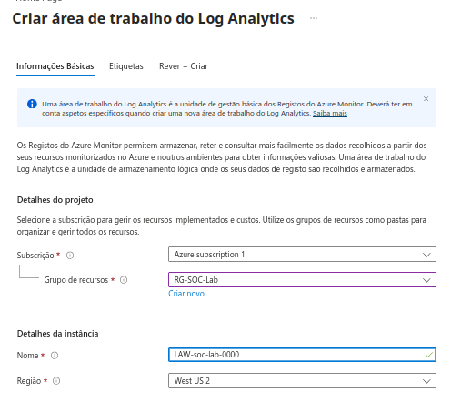

---
### 2️⃣ Deploy **Microsoft Sentinel** 

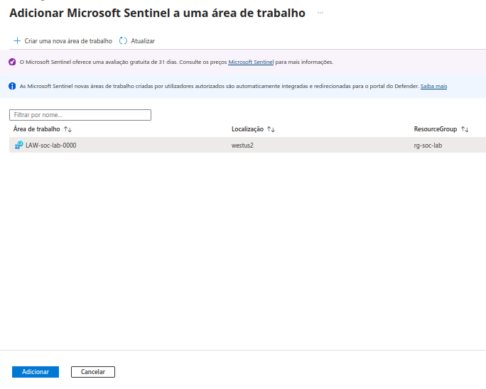

---

### Architecture overview (before VM connection to LAW):
  - At this stage, the VM is not yet connected to the Log Analytics Workspace.
  
  
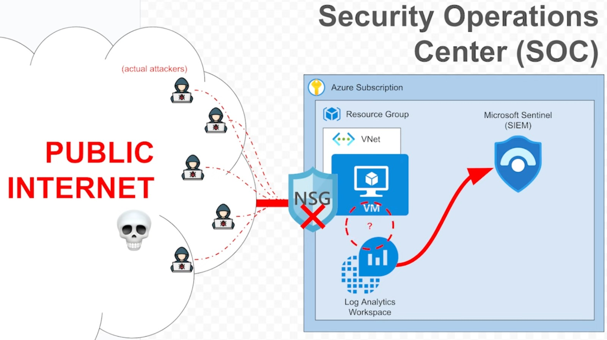

---
### Virtual Machine (Initial State):
  - No monitoring or security extensions were installed yet.
  - Navigate to **Extensions and Applications** to confirm the VM baseline state.

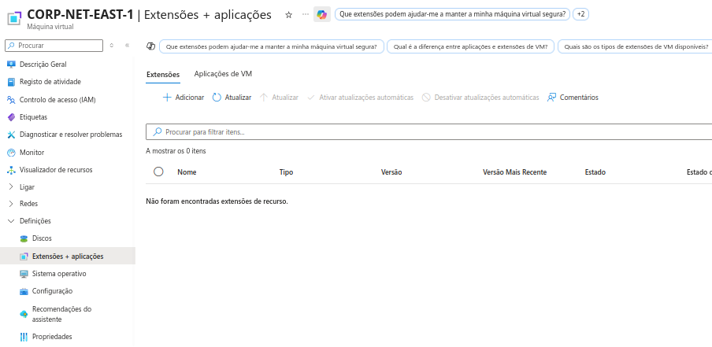

---

### 3️⃣ Install Windows Security Events
- In Microsoft Sentinel:
  - Go to **Content Management**
  - Install **Windows Security Events**

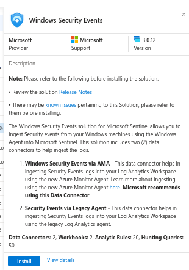

---
### 4️⃣ Configure Data Connector:
  - Windows Security Events via AMA
    - Open connector page

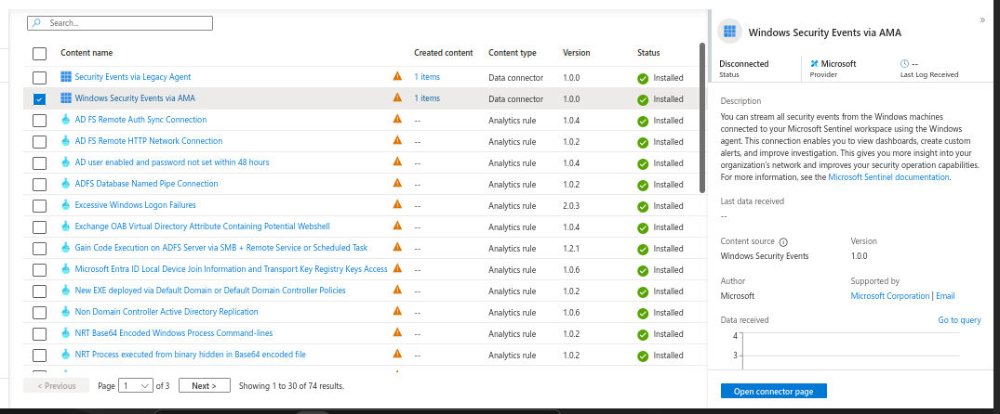

---
### 5️⃣ Create a **Data Collection Rule (DCR)** 
  - Define and deploy a **Data Collection Rule (DCR)** to collect and forward security events to the Log Analytics Workspace

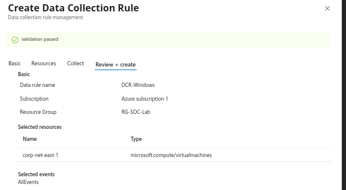

---

- After configuration, verify in the VM that the extension was installed:

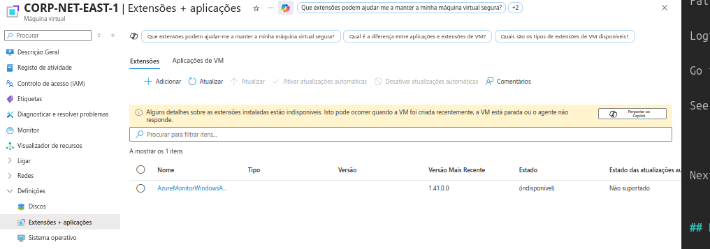

---

- The Log Analytics Workspace can now be queried using KQL.
  - Start by querying all Security Events.
  - At this stage, no logs are present.

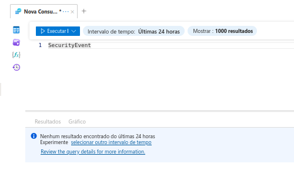

---

- Generate a failed login attempt via RDP (as performed in the previous step)

- Re-run the query — the corresponding event should now appear:

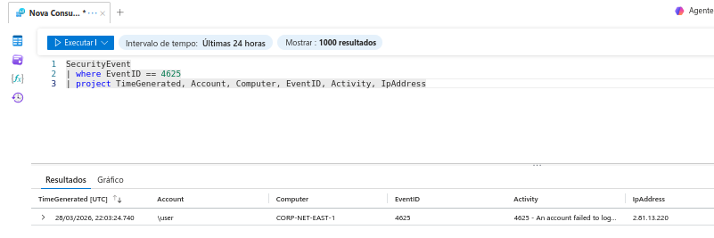

---

## Part 5. Log Enrichment and Finding Location Data

- The `SecurityEvent` logs in the Log Analytics Workspace were analyzed.
  - By default, logs only contain the source IP address, without any geographic context.

---
### 1️⃣ Download GeoIP dataset
- An open-source GeoIP dataset was used to enrich the logs:
  - File: `components/geoip-summarized.csv`
  - This dataset maps IP ranges to geographic locations.

---

### 2️⃣ Create a new watchlist

- In Microsoft Sentinel:

  - Go to **Configuration → Watchlist**
  - Create a new watchlist with the following settings:
    - **Name/Alias:** `geoip`
    - **Source type:** Local File
    - **Number of lines before row:** 0
    - **Search Key:** `network`

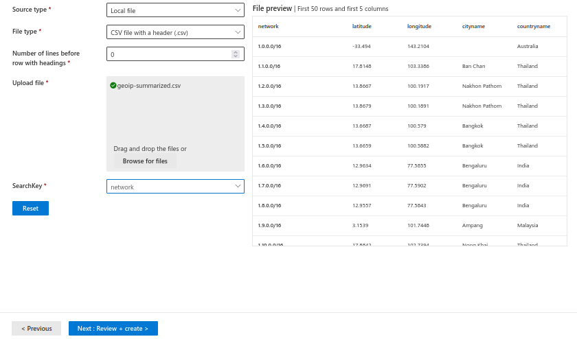

---

- After applying the enrichment, the logs now include geographic information:

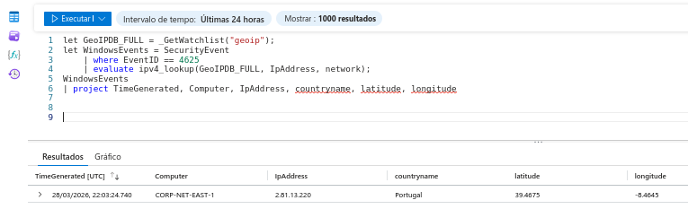

- This allows to:
  - Identify the origin country of attacks
  - Visualize attacker distribution
  - Correlate suspicious activity geographically
  
  
---
  
## Part 6. Attack Map Creation

### 1️⃣ Create new Workbook

- In Microsoft Sentinel:
  - Create a new **Workbook**

- Add a data source and visualization:

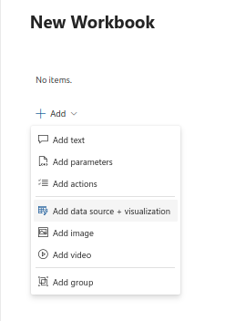

---

- Navigate to the **Advanced Editor** tab:

  - Paste the JSON configuration file (`components/map.json`)
  - Click **Apply** and **Done Editing**

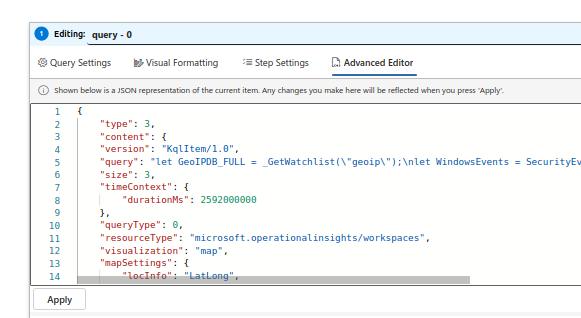

---

- Save the workbook with a descriptive name.

---

- This map provides:
  - A visual overview of attack origins 
  - Geographic correlation of failed login attempts
  - Improved situational awareness for security monitoring
  
---
  
  
## Part 7. Observing Real Attack Activity

- After leaving the virtual machine exposed to the internet for approximately 1–2 hours, external login attempts were observed.

- SecurityEvent logs showing multiple failed login attempts:

  - One attempt corresponds to a previous manual test
  - Two additional attempts originate from an external public IP: `194.165.16.164`
  - This IP is flagged as malicious on threat intelligence platforms (e.g., AbuseIPDB)

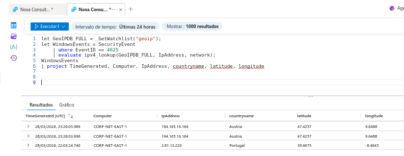

---

### 🌍 Attack Map visualization:

  - Two attack attempts originating from Austria (malicious IP)  
  - One attempt from Portugal (local test activity)

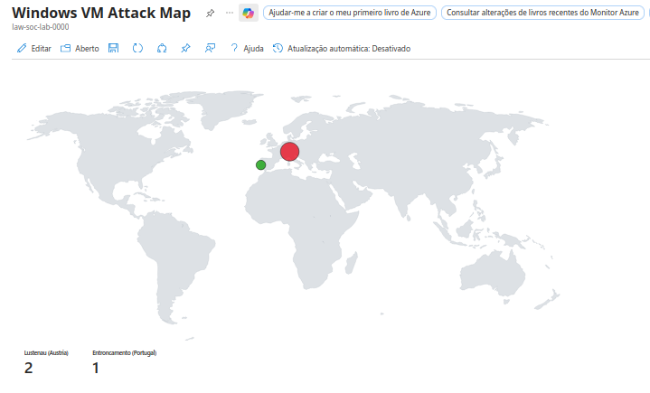

---

### 🔍 Key observations:
  - The exposed VM attracted real-world unauthorized access attempts 
  - Threat intelligence enrichment enabçe identification of malicious sources 
  - Geographic visualization provided clear insight into attack origins

---

### 🧠 SIEM Impact

  - Real-time threat detection in a cloud environment 
  - Effective log collection and enrichment  
  - Practical use of SIEM for security monitoring and analysis
  
  
---

- Additional attack activity was observed, including failed login attempts originating from the United States and Taiwan.

### 📊 Additional Attack Activity

  - Local activity (Portugal / internal testing) is highlighted in green 
  - A single failed login attempt is displayed in yellow
  - Multiple failed login attempts from the same source are displayed in red

- This color logic provides a clearer representation of attack intensity and distinguishes between benign, low, and high-risk activity.

